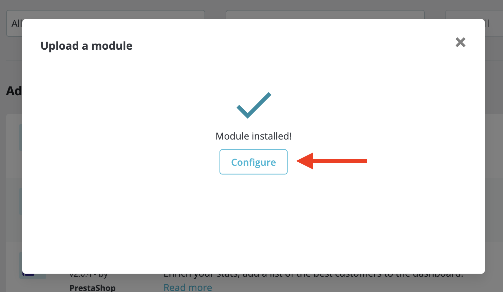

# Miguel for Prestashop

Prestashop module to sell watermarked ebooks and audiobooks.

## Installation

Installation is done in the classic way: you download our module and install it in your e-shop. You can download the module at the following link: [Download the latest version](https://github.com/servantes-io/miguel-prestashop/releases/latest). The module is created for Prestashop 1.7.

Open the administration of your e-shop. Each Prestashop installation has its own administration address, so the procedure in this step is individual.

1. Click on **Modules** > **Module manager**:

2. Click on **Upload a module**:

A dialog will appear in which you insert the [downloaded module](https://github.com/servantes-io/miguel-prestashop/releases/latest).

Once installed, you should see a confirmation message that the module is installed. Click on **Configure**:

The next step is described in the section: [Settings](../settings).

## Settings

In order for the module to communicate with Miguel's servers, it must be connected. This means creating an API key and inserting it into the module settings. You can find the settings in the administration of your e-shop under **Modules
** > **Module manager** and then at the **Miguel** module click **Configure**.

You will then see all the options for setting up the module.

- **API key** 
  This key is used to pair your e-shop with your Miguel account (see below).

- **Automatic order status switching** 
  Switching the order status after processing is complete on Miguel's side.

    - **The user has only purchased books from Miguel** 
      Miguel will only change the order status if everything went smoothly and the order contains only products that are also on Miguel.

    - **The user purchased books from Miguel as well as other products** 
      Miguel will only change the order status if everything went smoothly and the order contains various products.

- **Enable Miguel** 
  Enabling Miguel's operation. Change if you need to temporarily pause the module, otherwise leave it on.

In order for Miguel to work, you need an API key, which you can create in Miguel’s administration in the [Miguel Settings > API Key](https://app.servantes.cz/miguel/settings) section. You can name it for example `prestashop`. You can use the button next to the text to copy it (point 2. in the following picture).

And insert this key into the module settings:

Turn Miguel on by toggling **Enable Miguel** and click **Save** on the bottom right.

And you’re done.

Now the module should be connected to Miguel, all that's left is to create products and sell them.
